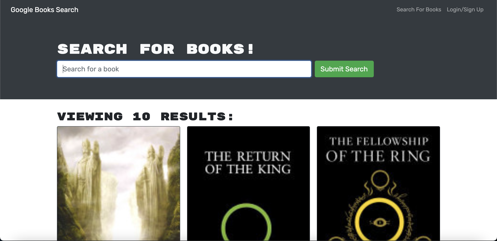

# MERN Book Search Engine

## Description

A Google Books API search engine built in React refactored from a RESTful API to a GraphQL API on Apollo Server.

## Table of Contents

* [License](#license)
* [Installation](#installation)
* [Usage](#usage)
* [Credits](#credits)
* [Contributions](#contributions)
* [Tests](#tests)

## License
    

## Installation

Download a zip file or clone it. Run `npm i` in the root, server, and client folders. 

## Usage

Visit the Book Search Engine here.

## Credits

Stackoverflow, my colleague Kim and my TA Shipra.

## Contributions

Open an issue on the existing repo or fork it to your own.

## Tests

Upon installation run `npm run watch` to test the backend using Apollo Playground. 

## Contact

Questions, comments, or conerns? Find me on [GitHub](https://github.com/rawagschal/) or [send me an email](mailto:rawagschal@gmail.com).